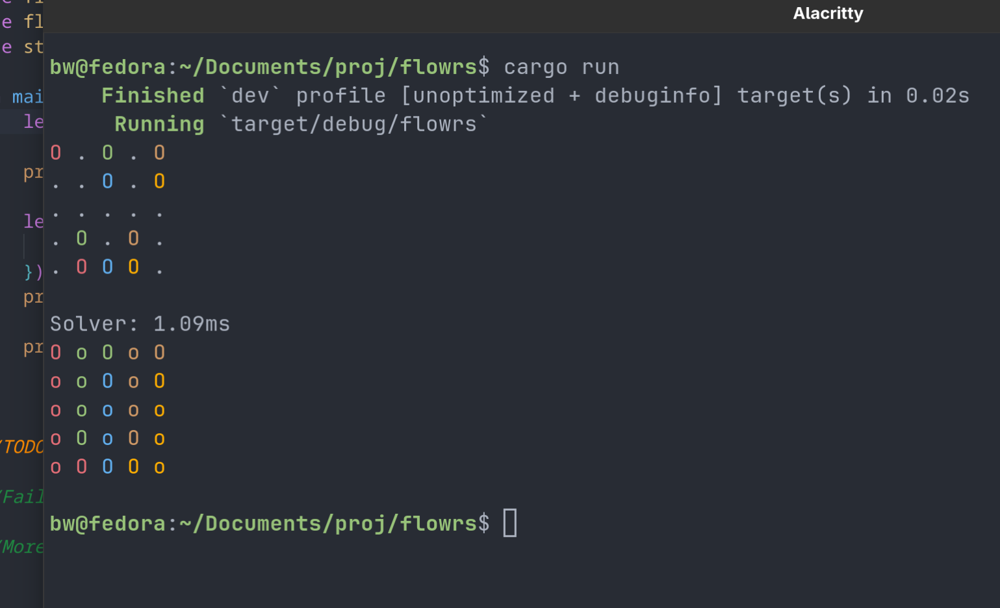
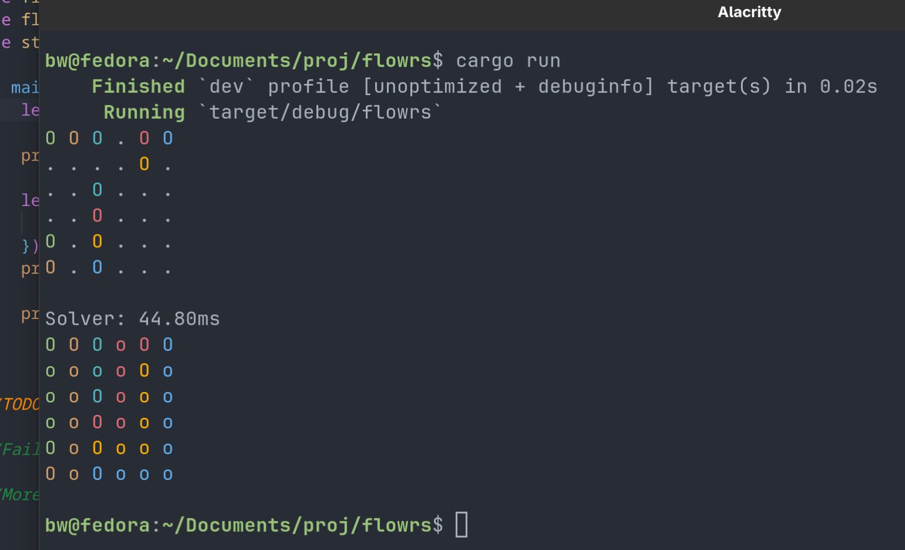
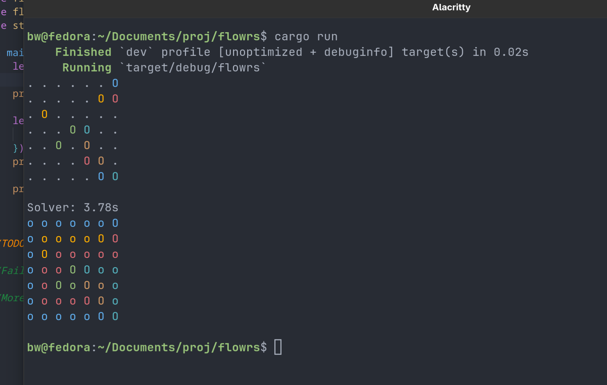

# Developper Logs for Flowrs

## June 23 2025

As of right now I have implemented the basic foundation of the Flow Solver project.

### Example images

This 7x7 grid takes a long time and trying the 8x8 is significantly longer. I have yet to let the program run long enough to solve an 8x8.

### board.rs

board.rs contains the basic structs/enums for Colour, Cell, Point, and Grid. These are used to create the grid in a matrix data structure. There are 16 colours and the Colour enum has a display trait. We defined an auxilary function for printing the colours in std::out. I originally wanted to have the endpoints as a capital letter and the paths as lowercase letters for their respective colour, but the 16 colours have overlap. I decided on using 'O' for an endpoint and 'o' for a path. The grid struct can be created in two ways: from a HashMap of colour and points, or from a txt (utils.rs) in the puzzles directory. Grid also has methods to check whether it is solved or a path is completed.

### lib.rs
Organizes the multiple file structure. I still do not really understand how this works in rust, can definitely make this more efficient.

### utils.rs
I basically looked up how to time a funciton in rust and copy and pasted the code. It allows me to time how long it takes to solve the puzzle. I also wrote code to generate the grid from the txt file. This functions basically finds the endpoints from the txt and passed it into the grid::new() func.

### solver.rs
I have yet to implement a better algorithm to solve the puzzles than brute force. I will base my algorithm off of c code from this repo (https://mzucker.github.io/2016/08/28/flow-solver.html). This repo inspired me to start this project.

### backtracking.rs
This file implements a brute-force solver for Flow puzzles using recursive backtracking.

**find_paths**

This is a helper function that finds all possible valid paths between two endpoints of the same colour. It does this by recursively exploring neighbouring cells. A path is valid if:
1. it only moves through empty cells or the endpoint of the correct colour,
2. it doesn’t revisit cells already in the current path (visited set keeps track of this),
3. and it terminates exactly at the target endpoint.

It returns a Vec<Vec<Point>>, which is a list of all valid paths found between the two endpoints.

The function keeps building up path as it goes, and clones it when it reaches the endpoint. It backtracks by popping points off the path when it's done exploring that route.

**brute_force**

This is the entry point for the brute-force solver.
1. It first finds all the endpoint pairs on the grid using find_endpoints(), which gives a map from each Colour to its pair of Points.
2. It transforms that into a list of (Colour, start, end) tuples for iteration.
3. Then it calls the recursive backtrack function.

**backtrack**

This function tries to recursively connect each colour's endpoints one pair at a time.

For each pair:
1. It finds all valid paths between the endpoints using find_paths.
For each valid path:
1. It tries setting the grid with that path (marks cells as Cell::Path(colour)).
2. Then it recursively calls backtrack to try solving the rest of the pairs.
3. If it succeeds, it returns true.
4. If not, it undoes the changes to the grid and tries the next path.

If it goes through all possible paths for a colour and none work, it backtracks all the way.

This function is extremely slow for larger grids because it tries every valid combination of paths — the number of paths grows quickly, especially in open grids. This is why the 7x7 is slow and 8x8 basically stalls.

Additionally, I have not implemented a error message for when the puzzle is impossible to solve. For example when trying `puzzles/unsolvable_cross.txt`, it does not have an error message and just leaves the grid unchanged.

### TODO:
- Implement solver.rs
- Error message for unsolvable puzzle
- Time trial mode (how many puzzles in X seconds) and benchmarking
- More puzzles as txt files for testing
- README.md
- Package for Github