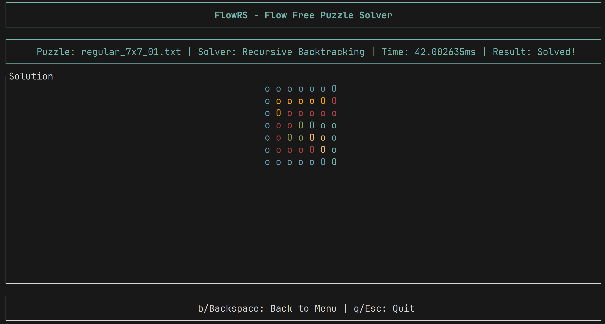

# FlowRS – Solver for Flow Free Puzzles
A Rust-based solver for puzzles from the Flow Free mobile game.

Inspired by mzucker’s flow-solver, this project aims to build efficient, modular solvers for Flow puzzles using Rust.

## Features
- Fully functional brute-force backtracking solver in Rust (backtracking.rs)
- Heuristic constraint-based solver with MRV ordering and pruning (heuristic.rs)
- Core puzzle logic and data structures (board.rs)
- File-based puzzle loading and runtime timing tools (utils.rs)
- CLI entry point and modular architecture (main.rs, lib.rs)

## Example Outputs
  
The 7x7 grid is slow to solve; 8x8 is significantly longer and may stall without further optimizations.
The 9x9 grid I have yet to solve with the brute force method.

# Project Structure
```text
flowrs/
├── Cargo.toml
├── media/                # Solution images
├── puzzles/              # Puzzle .txt files (5x5 to 14x14)
├── src/
    ├── backtracking.rs   # Brute-force solver
    ├── board.rs          # Grid, Point, Cell, Colour, etc.
    ├── lib.rs            # Project module entry
    ├── main.rs           # CLI runner
    └── utils.rs          # Puzzle file loading, timing utilities
```

## Modules Overview

*board.rs*

Defines the core types used in puzzles:
- Point, Colour, Cell, and Grid

- Grid display logic uses 'O' for endpoints and 'o' for paths (rather than letters per colour)

- Supports construction from a HashMap<Colour, [Point; 2]> or a .txt file

- Includes methods like is_solved, path_completed, and formatted output

*backtracking.rs*

Implements the brute-force recursive solver:
- find_paths: recursively finds all valid paths between a pair of endpoints

- brute_force: top-level solver that connects all colour pairs

- backtrack: core recursive logic, with path setting and undoing
The solver is correct but extremely slow for larger grids due to the exponential path combinations.

*utils.rs*
- Loads puzzles from the puzzles/ directory

- Extracts endpoints and builds a Grid

- Provides basic timing utilities for benchmarking solver runtime

*lib.rs*
Central module file that organizes all submodules.

## Sample Puzzles
Over 30 .txt files of varying difficulty (from 5x5 to 14x14) are included under the puzzles/ directory. For example:
```text
puzzles/regular_5x5_01.txt
puzzles/extreme_12x12_30.txt
puzzles/jumbo_14x14_19.txt
```
Each file contains coordinates for endpoints of different colours.

## Author
Created by Ben — Honours Math @ University of Waterloo
